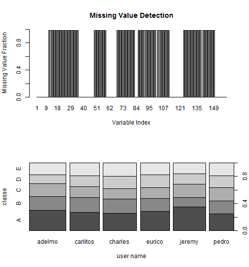
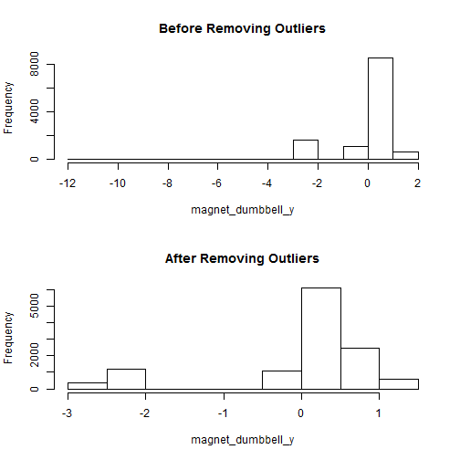
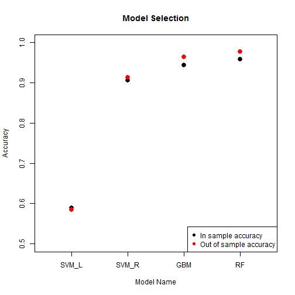

# HAR Course Project

## Abstract
This project analyzes the data from Human Action Recognition research and builds up a machine learning system to predict the type of Action. The description of the research and the data can be found on http://groupware.les.inf.puc-rio.br/har. The analysis in this project consists four parts: exploratory analysis, data preprocess, model selection and the final results. Exploratory analysis includes overview of the data which helps to decide the preprocess precedure. Data preprocess cleans the data which is suitable for training. Four types of models were trained with the training set and tested on the validation set. The best model (random forest) was selected based on the accuracy on the validation set. The final accuracy is obtained by prediction on the test set.


## Exploratory Analysis

The data set consists of 19622 observations and 159 variables including the outcome, the type of action (classe). After loaded in to R, the data set has one column of user_names (class factor), one column of time (class factor), and multiple columns consisting of missing values. The missing values are indentifed by "NA" or "". The fraction of missing values in each colomn is shown in Figure 1 (upper). The user names should not have any effect on the action type base on the nature of the research. This was varified by examing the outcome of each person. Figure 1 (lower) shows the distributions of the outcome of each person are similar.

<figure><figcaption>Figure 1: Missing values and user name effect.</figcaption></figure>

## Data Preprocess

Based on the exploratory analysis, the user name column and the columns with 95% or above of missing values are removed. Time data was converted into numeric. Variables with near zero variance were also removed. All the remaining predictors were centered at the mean and scaled with the variance. Then the whole data set was splited into training set (60%), validation set (20%), and testing set (20%). In the trainig set, the outliers were detected by examing the hist plot of each predictor and then were removed. The covariance matrix of predictors shows the necessity of PCA (Principle Component Analysis). After PCA, the predictors are ready for training.

<figure><figcaption>Figure 2: Demonstration of outlier treatment.</figcaption></figure>

## Model Selection

The training set was trained with four models: svmLinear (Supported Vector Machine with linear kernal), svmRadial (Support Vector Machines with Radial Kernel), gbm (Stochastic Gradient Boosting), and rf (Random Forest). The the models were applied to validation set to obain the out of sample error/accuracy. Both in sample (training set) and out of sample (validation set) accuracies for all models are shown in Figure 3. Both in sample and out of sample accuracies of the same model are similar, meaning there is no overfitting. The RF (random forest) model has the highest out of sample accuracy and thus was selected as final model.


<figure><figcaption>Figure 3: Model selection based on accuracy</figcaption></figure>

## Results

The selected model (RF) was applied on the test set to report the final accuracy of the model. The accuray of the model is 97.2%. The other statistical errors can be found below. 


```
## Confusion Matrix and Statistics
## 
##           Reference
## Prediction    A    B    C    D    E
##          A 1103   12    1    2    0
##          B    5  736   13    0    2
##          C    6   10  663   41    2
##          D    2    1    5  598    3
##          E    0    0    2    2  714
## 
## Overall Statistics
##                                         
##                Accuracy : 0.972         
##                  95% CI : (0.967, 0.977)
##     No Information Rate : 0.284         
##     P-Value [Acc > NIR] : <2e-16        
##                                         
##                   Kappa : 0.965         
##  Mcnemar's Test P-Value : NA            
## 
## Statistics by Class:
## 
##                      Class: A Class: B Class: C Class: D Class: E
## Sensitivity             0.988    0.970    0.969    0.930    0.990
## Specificity             0.995    0.994    0.982    0.997    0.999
## Pos Pred Value          0.987    0.974    0.918    0.982    0.994
## Neg Pred Value          0.995    0.993    0.993    0.986    0.998
## Prevalence              0.284    0.193    0.174    0.164    0.184
## Detection Rate          0.281    0.188    0.169    0.152    0.182
## Detection Prevalence    0.285    0.193    0.184    0.155    0.183
## Balanced Accuracy       0.992    0.982    0.976    0.963    0.995
```


